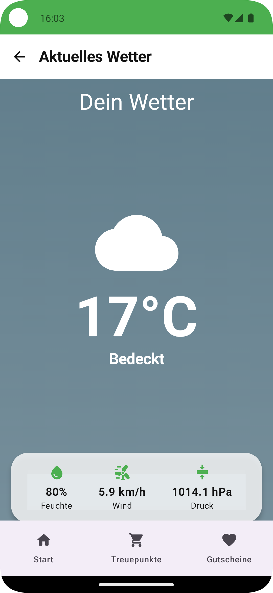

# TreueBiss – White-Label Loyalty App (MVP)

**"TreueBiss – Digitalisierung mit Biss für’s Handwerk"**

## Projektbeschreibung

**TreueBiss** ist eine native Android-App, die als Minimum Viable Product (MVP) im Rahmen des **Abschlussprojekts App-Entwicklung am Syntax Institut** entwickelt wurde.  
Sie dient als White-Label-Grundlage für digitale Kundenbindungs-Apps im Lebensmittelhandwerk (z. B. Bäckereien, Metzgereien, Hofläden).

## Ziel der App

Handwerksbetrieben im Lebensmittelbereich eine **einfache, sofort einsetzbare digitale Stempelkarte** zu bieten – als Ersatz oder Ergänzung zur klassischen Papierkarte. Die App soll die Kundenbindung stärken, Promotions vereinfachen und digitale Mehrwerte wie Push-Nachrichten oder Wetter-Infos bereitstellen.

## Problemstellung

Viele kleine und mittelständische Betriebe im Handwerk haben keine **einheitliche digitale Kundenbindungsstrategie**. Papierkarten gehen verloren, Kundenbindung ist kaum messbar und Wettbewerber mit eigener App (z. B. große Bäckereiketten) ziehen davon.  
Gleichzeitig fehlt oft das Know-how oder Budget, um eigene Apps zu entwickeln.

## Lösungsansatz (MVP)

TreueBiss stellt ein **White-Label-App-Framework** bereit, das individuell auf Betriebe angepasst werden kann (Corporate Design, Texte, Logos).  
Das MVP demonstriert die Kernfunktionen: digitale Stempelkarte, Gutscheinlogik, Supabase-Backend-Sync, sowie Erweiterungen (z. B. Wetteranzeige, Dialektumschaltung).

## Was macht die App anders/besser?

- **White-Label ready:** Branding (Farben, Logo, Texte) kann pro Kunde zentral angepasst werden.
- **Einfachheit:** Kein komplexes Kassensystem nötig, QR-Scan oder Button reicht für Stempel.
- **Handwerk-Fokus:** Inhalte und Features orientieren sich an den Bedürfnissen des Lebensmittelhandwerks.
- **Skalierbarkeit:** Architektur nach Best Practices (Hexagonal, Hilt, Repository Pattern).

## Kern-Features (MVP V1.0)

- [ ] **Onboarding:** Vorstellung der Kernfunktionen beim Start.
- [ ] **Digitale Stempelkarte:**
    - Sammeln von Stempeln (10er-Karte).
    - Automatische Erstellung eines Gutscheins nach 10 Stempeln.
- [ ] **Gutscheinverwaltung:**
    - Anzeige offener Gutscheine.
    - Einlösen-Button (lokal + Supabase Sync).
    - Gutscheinverfalls-Service (markiert abgelaufene).
- [ ] **Supabase-Integration:**
    - Sync von Stempeln und Gutscheinen.
    - RLS Policies pro Nutzer.
- [ ] **WorkManager-Sync:** Automatischer Abgleich alle 24h.
- [ ] **Wetteranzeige:** Anzeige der aktuellen Wetterdaten (OpenMeteo API) auf dem HomeScreen.
- [ ] **Dialekt-Umschaltung:** Auswahl zwischen Hochdeutsch und Monnemer Dialekt beim App-Start.
- [ ] **Corporate Branding:** Zentrale Theme-Datei, BrandingConfig (Farben, Logo, Strings).

### Sicherheit & Datenschutz (pseudonyme Geräte-ID)

- Keine personenbezogenen Daten (kein Name, keine E-Mail).
- Beim ersten Start wird eine zufällige `UUID` als **Geräte-ID** erzeugt und lokal verschlüsselt gespeichert.
- Die App erhält von einer Supabase **Edge Function** ein kurzlebiges JWT, das nur die Claims `device_id` und `tenant_id` enthält.
- **RLS (Row Level Security)** in der Datenbank stellt sicher: Jede Aktion betrifft ausschließlich die eigenen Geräte-Daten im eigenen Mandanten.
- Datenlöschung: In den App-Einstellungen kann eine vollständige Löschung aller Datensätze zur Geräte-ID angestoßen werden (Server-seitige Cleanup-Function).

## Design

  
  
  
  

## Projektstruktur & Architektur Übersicht

### 1. Architektur: Hexagonal + MVVM
- **Data-Layer:** Room (lokal), Retrofit (API), Supabase (Remote).
- **Domain-Layer:** Repository-Interfaces als Ports, Business-Logik (Stempelkarte, Gutschein).
- **UI-Layer:** Jetpack Compose Screens, Navigation, Theme.
- **DI-Layer:** Hilt-Module für Database, Network, SupabaseClient.

### 2. Abstraktion der Datenquelle: Repository Pattern
Repositories kapseln Datenzugriff (lokal/remote).  
UI/ViewModels kommunizieren nur mit Repositories → bessere Testbarkeit & Austauschbarkeit.

---

## Technologie-Stack

- **Plattform:** Android
- **Sprache:** Kotlin
- **UI-Framework:** Jetpack Compose
- **Architektur:** MVVM + Hexagonal Architektur
- **Dependency Injection:** Hilt
- **Persistenz:** Room (lokal), Supabase (Backend-Sync)
- **Networking:** Retrofit + Coroutines/Flow
- **Navigation:** Compose Navigation (typisierte Routes)
- **State Management:** StateFlow + ViewModelScope

### Externe Abhängigkeiten
- **Supabase-kt:** Kotlin SDK für Supabase.
- **Room:** SQLite Abstraktion für lokale Persistenz.
- **Retrofit:** HTTP-Client für Wetter-API.
- **WorkManager:** Hintergrundjobs (Sync).
- **Kotlinx Coroutines & Flow:** Asynchrone Datenströme.

---

## Ausblick

- [ ] **QR-Code-Scanner:** Integration ML Kit Barcode Scanning.
- [ ] **Admin-Panel:** Angebot der Woche für Betriebe editierbar.
- [ ] **Pilotkunden-Rollout:** Erste White-Label-Instanzen für Partnerbetriebe.
- [ ] **Erweiterte Analytics:** Nutzungsauswertung, Conversion-Tracking.
- [ ] **Mehrsprachigkeit:** Erweiterung um weitere Dialekte/Sprachen.
- [ ] **Cross-Platform:** iOS-Version mit SwiftUI.

---

## Autor

**Dominik Baki**, Student am **Syntax Institut** im Kurs Fachkraft für App-Entwicklung (iOS & Android).

## Danksagung

- Dank an die Dozenten & Tutoren des Syntax Instituts für Feedback und Begleitung.
- Besonderer Dank an die Testbetriebe aus dem Lebensmittelhandwerk für erste Gespräche & Feedback.
- Wetterdaten bereitgestellt durch die **OpenMeteo API**.
- Backend-Dienste bereitgestellt durch **Supabase**.  