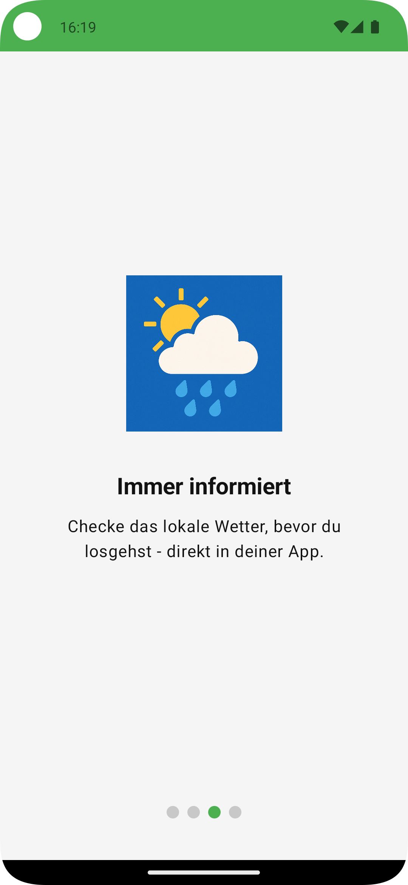
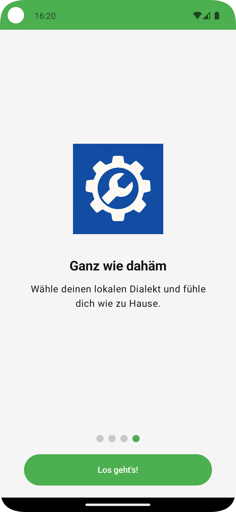

# TreueBiss – White-Label Loyalty App (MVP)

**"TreueBiss – Digitalisierung mit Biss für’s Handwerk"**

## Projektbeschreibung

**TreueBiss** ist eine native Android-App, die als Minimum Viable Product (MVP) im Rahmen des **Abschlussprojekts App-Entwicklung am Syntax Institut** entwickelt wurde.  
Sie dient als White-Label-Grundlage für digitale Kundenbindungs-Apps im Lebensmittelhandwerk (z. B. Bäckereien, Metzgereien, Hofläden).

## Ziel der App

Handwerksbetrieben im Lebensmittelbereich eine **einfache, sofort einsetzbare digitale Stempelkarte** zu bieten – als Ersatz oder Ergänzung zur klassischen Papierkarte. Die App soll die Kundenbindung stärken und Promotions vereinfachen.

## Problemstellung

Viele kleine und mittelständische Betriebe im Handwerk haben keine **einheitliche digitale Kundenbindungsstrategie**. Papierkarten gehen verloren, Kundenbindung ist kaum messbar und Wettbewerber mit eigener App (z. B. große Bäckereiketten) ziehen davon.  
Gleichzeitig fehlt oft das Know-how oder Budget, um eigene Apps zu entwickeln.

## Lösungsansatz (MVP)

TreueBiss stellt ein **White-Label-App-Framework** bereit, das individuell auf Betriebe angepasst werden kann (Corporate Design, Texte, Logos).  
Das MVP demonstriert die Kernfunktionen: digitale Stempelkarte, Gutscheinlogik und Supabase-Backend-Sync.

## Was macht die App anders/besser?

- **White-Label ready:** Branding (Farben, Logo, Texte) kann pro Kunde zentral angepasst werden.
- **Einfachheit:** Kein komplexes Kassensystem nötig, QR-Scan reicht für Stempel.
- **Handwerk-Fokus:** Inhalte und Features orientieren sich an den Bedürfnissen des Lebensmittelhandwerks.
- **Skalierbarkeit:** Architektur nach Best Practices (Hexagonal, Hilt, Repository Pattern).

## Kern-Features (MVP V1.0)

- [x] **Onboarding:** Vorstellung der Kernfunktionen beim Start.
- [x] **Digitale Stempelkarte:**
    - Sammeln von Stempeln, Kartengröße pro Betrieb einstellbar.
    - Automatische Erstellung eines Gutscheins bei voller Karte.
- [x] **Serverseitige Stempelvergabe:** Stempel entstehen ausschließlich über die
    Datenbankfunktion `issue_stamp` und nur gegen einen Kaufnachweis. Die App hat
    auf `stamps` und `vouchers` kein Schreibrecht.
- [x] **Gutscheinverwaltung:**
    - Anzeige offener Gutscheine.
    - Einlösen-Button (lokal + Supabase Sync).
- [x] **Supabase-Integration:**
    - Stempel und Gutscheine werden beim Anlegen zum Backend geschrieben.
    - Nach einer Neuinstallation werden die Daten einmalig vom Server zurückgeholt.
    - RLS Policies pro Nutzer.
- [x] **Mandantenfähigkeit:** Betriebe liegen als `tenants` im Backend. Ein Build
  ist über `TENANT_ID` einem Betrieb zugeordnet; Name, Bezeichnungen, Primärfarbe
  und die Kartenregeln (Stempel pro Karte, Gültigkeitsdauer) kommen von dort.
- [x] **Angebote:** Werden im Backend gepflegt und auf dem HomeScreen angezeigt.
- [x] **Corporate Branding:** Zur Laufzeit aus dem Betrieb, mit neutralem
  Platzhalter solange keine Serverdaten vorliegen.

### Sicherheit & Datenschutz (anonyme Anmeldung)

- Keine personenbezogenen Daten (kein Name, keine E-Mail).
- Beim ersten Start meldet sich die App über **Supabase Anonymous Sign-in** an. Die
  dabei vergebene `user_id` ist die einzige Kennung; sie wird nicht mit einer Person
  verknüpft. Anonyme Anmeldungen müssen im Supabase-Projekt aktiviert sein.
- **RLS (Row Level Security)** in der Datenbank stellt sicher: Jede Aktion betrifft
  ausschließlich die eigenen Datensätze.
- Beim Zurücksetzen der Stempelkarte werden die Stempel auch serverseitig gelöscht.

> Geplant, aber noch **nicht** umgesetzt: eine pseudonyme Geräte-ID mit
> mandantenfähigem JWT (`device_id`/`tenant_id`) über eine Supabase Edge Function
> sowie eine vollständige Datenlöschung aus den App-Einstellungen heraus. Der
> Einstellungs-Screen ist derzeit reine Oberfläche ohne Funktion.

## Design

<p>
  
  
  
  
  
  
  
  
  
</p>

## Einrichtung

1. `local.properties.example` nach `local.properties` kopieren.
2. `SUPABASE_URL` und `SUPABASE_ANON_KEY` aus den Projekt-Einstellungen bei Supabase eintragen.
3. Anonyme Anmeldungen im Supabase-Projekt aktivieren.
4. `supabase/schema.sql` im SQL-Editor des Projekts ausführen. Das legt Tabellen,
   RLS-Policies und einen Demo-Betrieb an.
5. `TENANT_ID` in `local.properties` auf den gewünschten Betrieb setzen. Ohne
   Eintrag wird der Demo-Betrieb aus dem Schema verwendet.

Ohne die Supabase-Werte startet die App zwar, kann sich aber nicht anmelden: Der
Client fällt auf `https://localhost` zurück, die Anmeldung läuft in einen
Verbindungsfehler und es erscheint der Fehlerbildschirm mit „Wiederholen“.

```bash
./gradlew assembleDebug
```

### Datenbank-Tests

Das Schema und die Stempelvergabe lassen sich lokal prüfen, ohne ein
Supabase-Projekt. Der Runner startet ein temporäres Postgres, spielt Schema und
Tests ein und räumt danach auf:

```bash
./supabase/test/run.sh
```

Voraussetzung: `brew install postgresql@16`. Die Tests decken die Vergabe
(Mitgliedschaft, doppelter Beleg, Gutschein bei voller Karte, Kartenreset) und
die RLS-Policies ab. `supabase/test/00_supabase_stubs.sql` bildet die Teile von
Supabase nach, die das Schema voraussetzt - insbesondere die Standardrechte für
`anon` und `authenticated`, ohne die die Policies gar nicht zum Tragen kämen.

## Projektstruktur & Architektur Übersicht

### 0. Stempelvergabe

Ein Stempel entsteht nur serverseitig, gegen einen Kaufnachweis - beim
Kassenbon die TSE-Transaktionsnummer. `issue_stamp` prüft Mitgliedschaft und
Nachweis, legt bei voller Karte in derselben Transaktion den Gutschein an und
setzt die Karte zurück. Ein `unique (tenant_id, proof_ref)` verhindert auf
Datenbankebene, dass derselbe Beleg zweimal zählt.

Die App darf in `stamps` und `vouchers` nicht schreiben. Das ist der Kern:
Solange der Client selbst schreiben kann, ist jede Prüfung Fassade.

Folge: **Stempeln braucht eine Verbindung.** Nur der Server kann beurteilen, ob
ein Beleg echt und noch unbenutzt ist. Ohne Verbindung erscheint ein Hinweis,
statt einen Stempel zu vergeben, der später zurückgenommen werden müsste.

Der Demo-Knopf, der ohne Beleg stempelt, ist auf Debug-Builds beschränkt.

### 1. Kassenseite für den Betrieb

`web/kasse/index.html` — eine einzelne Seite ohne Build-Schritt. Das Personal
öffnet sie im Browser, meldet sich an, scannt den Gutschein-QR des Kunden und
sieht die Zahlen des eigenen Betriebs.

**Einrichten:**

1. `web/kasse/config.example.js` nach `config.js` kopieren und die Werte des
   Supabase-Projekts eintragen.
2. Im Supabase-Dashboard unter *Authentication → Users* einen Zugang für den
   Betrieb anlegen.
3. Den Zugang dem Betrieb zuordnen:
   ```sql
   insert into public.tenant_staff (user_id, tenant_id)
   values ('<user-id>', '<tenant-id>');
   ```
4. Die Seite über `https` oder `localhost` ausliefern. **Die Kamera funktioniert
   nicht aus einer lokal geöffneten Datei** (`file://` ist kein sicherer
   Kontext). Zum Ausprobieren genügt:
   ```bash
   cd web/kasse && python3 -m http.server 8777
   ```

Die QR-Erkennung nutzt die `BarcodeDetector`-API — vorhanden in Chrome und auf
Android, nicht in Safari und Firefox. Die Eingabe der Gutschein-Nummer per Hand
ist deshalb gleichwertig ausgelegt und nicht nur Notlösung.

Das Personal löst über `staff_redeem_voucher()` ein. Die reguläre
`redeem_voucher()` prüft auf Besitz des Gutscheins — das Personal ist aber
nicht der Besitzer. Hier ersetzt die Beschäftigung beim Betrieb diesen
Nachweis, und damit auch den Einlöse-Code: Wer scannt, ist der Betrieb.

### 2. Auswertung für den Piloten

Vier Views in `supabase/schema.sql` liefern die Zahlen, an denen sich
entscheidet, ob das Programm trägt:

| View | Beantwortet |
|---|---|
| `pilot_daily_signups` | Wie viele Teilnehmer kommen pro Tag dazu? |
| `pilot_daily_stamps` | Werden Stempel weiterhin vergeben, oder bricht es nach Woche zwei ab? |
| `pilot_daily_redemptions` | Werden Gutscheine tatsächlich eingelöst? |
| `pilot_summary` | Gesamtbild pro Betrieb, inkl. Stempel pro aktivem Tag und Einlösequote |

Zu lesen im Supabase-Studio unter *Table Editor* oder per SQL. Die Views sind
für die App **nicht** lesbar — sie aggregieren über alle Kunden eines Betriebs.

Bewusst gibt es **kein zusätzliches Event-Log**: Die Zahlen stammen aus
`memberships`, `stamp_proofs` und `vouchers`, die ohnehin geführt werden.

Die Tagesgrenze liegt in **Europe/Berlin**, nicht in UTC. Ohne das hinge das
Ergebnis an der Zeitzone der lesenden Sitzung, und abendliche Vergaben nach
22 Uhr Ortszeit landeten still auf dem Folgetag.

Was die App **nicht** messen kann: wie viele Menschen den Flyer gesehen haben.
Der Nenner der Installationsrate muss vom Betrieb kommen — notiere die Zahl
der ausgegebenen Flyer, sonst ist die wichtigste Quote später nicht bildbar.

Zwei Dinge, die bei bestehenden Projekten auffallen können: Vor der Einführung
von `redeemed_at` eingelöste Gutscheine erscheinen nicht in
`pilot_daily_redemptions` — `pilot_summary.redemptions_without_timestamp`
weist sie getrennt aus. Und Nutzer aus der Zeit vor den Mitgliedschaften haben
Gutscheine, aber keinen Eintrag in `memberships`; `members` zählt sie deshalb
nicht mit.

### 3. Mandantenfähigkeit

Stempel und Gutscheine tragen eine `tenant_id`; die Stempelkarte gilt pro
(Nutzer, Betrieb). Die ID des Betriebs steht über `BuildConfig.TENANT_ID` fest,
damit lokale Daten schon vor dem ersten Serverkontakt zugeordnet werden können -
die App ist offline-fähig. Vom Server kommen nur Branding, Angebote und Regeln.

Das Schema ist damit bereits auf mehrere Betriebe ausgelegt. Der Wechsel auf eine
App mit Beitritt per Code (mehrere Betriebe gleichzeitig) braucht keine
Schemaänderung mehr, nur noch die Oberfläche dafür.

Pflege von `tenants` und `offers` läuft über den Service-Role-Key, nicht aus der
App - hier dockt später ein Admin-Backend an.

### 4. Architektur: Hexagonal + MVVM
- **Data-Layer:** Room (lokal), Supabase (Remote).
- **Domain-Layer:** Repository-Interfaces als Ports, Business-Logik (Stempelkarte, Gutschein).
- **UI-Layer:** Jetpack Compose Screens, Navigation, Theme.
- **DI-Layer:** Hilt-Module für Database, Network, SupabaseClient.

### 5. Abstraktion der Datenquelle: Repository Pattern
Repositories kapseln Datenzugriff (lokal/remote).  
UI/ViewModels kommunizieren nur mit Repositories → bessere Testbarkeit & Austauschbarkeit.

---

## Technologie-Stack

- **Plattform:** Android
- **Sprache:** Kotlin
- **UI-Framework:** Jetpack Compose
- **Architektur:** MVVM + Hexagonal Architektur
- **Dependency Injection:** Hilt
- **Persistenz:** Room (lokal), Supabase (Backend-Sync)
- **Navigation:** Compose Navigation (typisierte Routes)
- **State Management:** StateFlow + ViewModelScope

### Externe Abhängigkeiten
- **Supabase-kt:** Kotlin SDK für Supabase.
- **Room:** SQLite Abstraktion für lokale Persistenz.
- **ZXing:** Erzeugung der Gutschein-QR-Codes.
- **Kotlinx Coroutines & Flow:** Asynchrone Datenströme.

---

> **Hinweis zur Wetteranzeige:** Sie war eine Anforderung des Abschlussprojekts und
> ist nach bestandener Prüfung entfernt worden. Für eine Stempelkarten-App brachte sie
> keinen Nutzen, kostete aber zwei Standortberechtigungen und einen Berechtigungsdialog
> beim ersten Start.

## Ausblick

- [ ] **QR-Code-Scanner:** Integration ML Kit Barcode Scanning.
- [ ] **Admin-Panel:** Oberfläche, über die Betriebe Angebote und Branding selbst
      pflegen. Datenseitig ist alles vorhanden, es fehlt die Bedienoberfläche.
- [ ] **Beleg-Scanner:** ML Kit Barcode Scanning, um den QR-Code auf dem Kassenbon
      einzulesen. Die serverseitige Vergabe dahinter steht bereits; es fehlt der
      Scanner und das Auslesen der TSE-Transaktionsnummer.
- [ ] **Einlösen serverseitig autorisieren:** Der Kunde markiert seinen Gutschein
      weiterhin selbst als eingelöst. Für den Einsatz an der Kasse muss auch das
      über eine geprüfte Funktion laufen.
- [ ] **Beitritt per Code:** Mehrere Betriebe in einer App.
- [ ] **Pilotkunden-Rollout:** Erste White-Label-Instanzen für Partnerbetriebe.
- [ ] **Erweiterte Analytics:** Nutzungsauswertung, Conversion-Tracking.
- [ ] **Dialekt-Umschaltung:** Auswahl zwischen Hochdeutsch und Monnemer Dialekt beim App-Start.
- [ ] **Mehrsprachigkeit:** Erweiterung um weitere Dialekte/Sprachen.
- [ ] **Cross-Platform:** iOS-Version mit SwiftUI.
- [ ] **Gutscheinverwaltung:**
      - Aufräum-Service für lange abgelaufene Gutscheine. Abgelaufene Gutscheine
        werden bereits als solche angezeigt und nicht mehr mitgezählt, bleiben
        aber in der Liste stehen.
- [ ] **WorkManager-Sync:** Automatischer Abgleich alle 24h. Aktuell wird nur
      beim Anlegen geschrieben und einmalig nach einer Neuinstallation gelesen -
      es gibt keinen laufenden Abgleich und keine Warteschlange für
      fehlgeschlagene Schreibvorgänge.
- [ ] **Einstellungen:** Funktionen hinterlegen (Dunkelmodus, Benachrichtigungen,
      Datenlöschung) - der Screen ist bisher statisch.
- [ ] **Corporate Branding:** Zentrale Theme-Datei


---

## Autor

**Dominik Baki**, Student am **Syntax Institut** im Kurs Fachkraft für App-Entwicklung (iOS & Android).

## Danksagung

- Dank an die Dozenten & Tutoren des Syntax Instituts für Feedback und Begleitung.
- Besonderer Dank an die Testbetriebe aus dem Lebensmittelhandwerk für erste Gespräche & Feedback.
- Backend-Dienste bereitgestellt durch **Supabase**.  