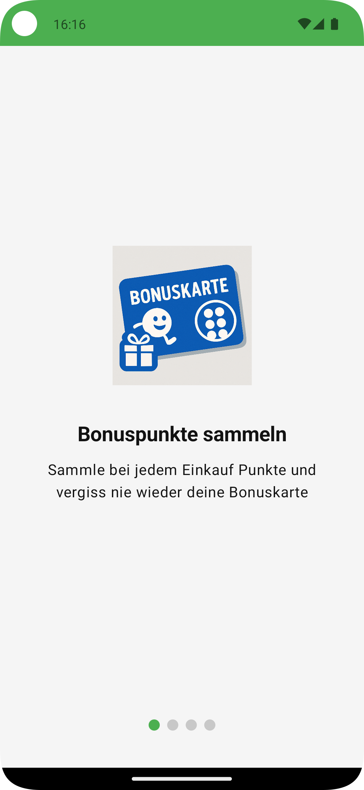
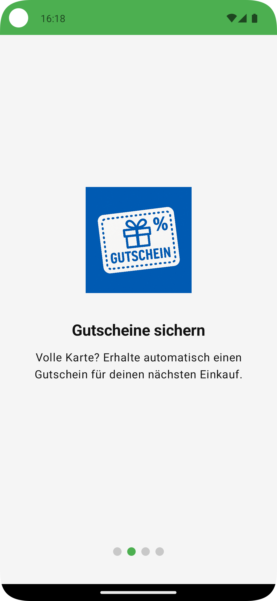
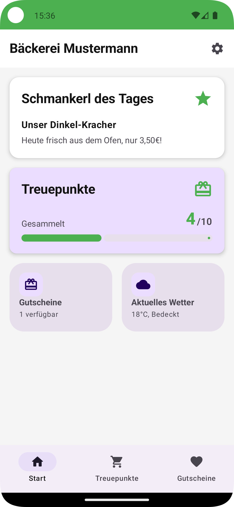
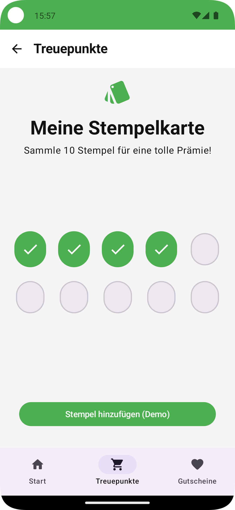
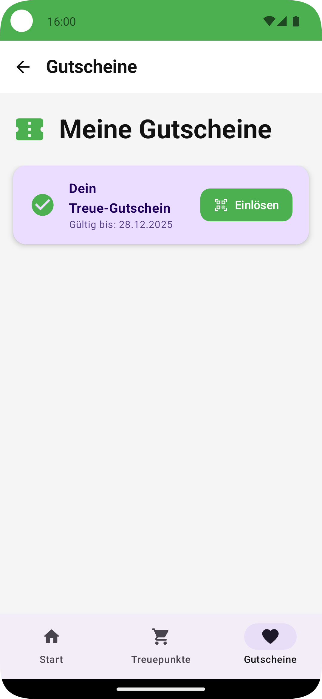
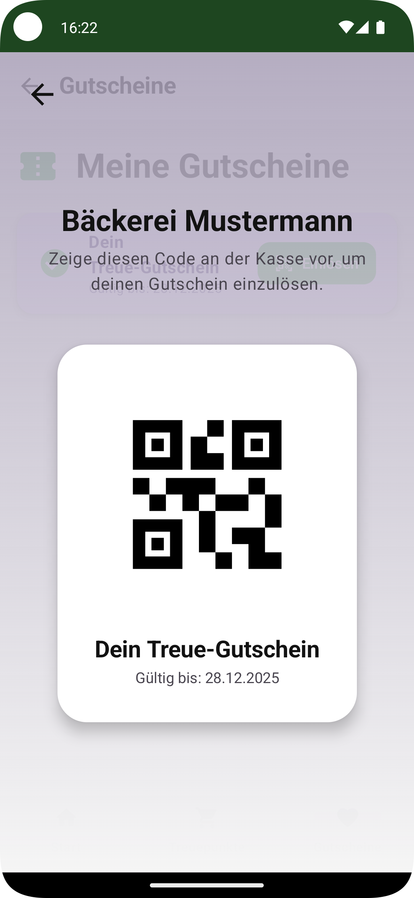
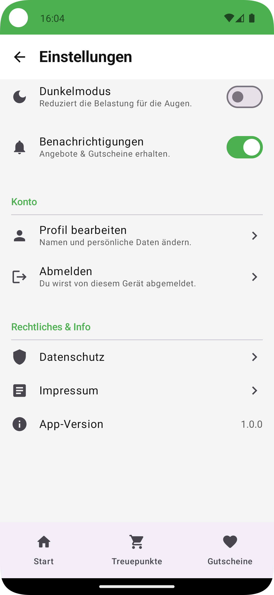

# TreueBiss – White-Label Loyalty App (MVP)

**"TreueBiss – Digitalisierung mit Biss für’s Handwerk"**

## Projektbeschreibung

**TreueBiss** ist das Produkt von **byte & Handwerk** für Betriebe im Lebensmittelhandwerk — Bäckereien, Metzgereien, Hofläden, Feinkost und ähnliche Betriebe.  
Entstanden ist es als native Android-App und Minimum Viable Product (MVP) im Rahmen des **Abschlussprojekts App-Entwicklung am Syntax Institut**; die White-Label-Grundlage daraus trägt das Produkt bis heute.

## Ziel der App

Betrieben im Lebensmittelhandwerk eine **einfache, sofort einsetzbare digitale Stempelkarte** zu bieten – als Ersatz oder Ergänzung zur klassischen Papierkarte. Die App soll die Kundenbindung stärken und Promotions vereinfachen.

## Problemstellung

Viele kleine und mittelständische Betriebe im Handwerk haben keine **einheitliche digitale Kundenbindungsstrategie**. Papierkarten gehen verloren, Kundenbindung ist kaum messbar und Wettbewerber mit eigener App (z. B. große Bäckereiketten) ziehen davon.  
Gleichzeitig fehlt oft das Know-how oder Budget, um eigene Apps zu entwickeln.

## Lösungsansatz (MVP)

TreueBiss stellt ein **White-Label-App-Framework** bereit, das individuell auf Betriebe angepasst werden kann (Corporate Design, Texte, Logos).  
Das MVP demonstriert die Kernfunktionen: digitale Stempelkarte, Gutscheinlogik und Supabase-Backend-Sync.

## Was macht die App anders/besser?

- **White-Label ready:** Branding (Farben, Logo, Texte) kann pro Kunde zentral angepasst werden.
- **Einfachheit:** Kein komplexes Kassensystem nötig, QR-Scan reicht für Stempel.
- **Handwerk-Fokus:** Inhalte und Features orientieren sich an den Bedürfnissen des Lebensmittelhandwerks.
- **Skalierbarkeit:** Architektur nach Best Practices (Hexagonal, Hilt, Repository Pattern).

## Kern-Features (MVP V1.0)

- [x] **Onboarding:** Vorstellung der Kernfunktionen beim Start.
- [x] **Digitale Stempelkarte:**
    - Sammeln von Stempeln, Kartengröße pro Betrieb einstellbar.
    - Automatische Erstellung eines Gutscheins bei voller Karte.
- [x] **Serverseitige Stempelvergabe:** Stempel entstehen ausschließlich über die
    Datenbankfunktion `issue_stamp` und nur gegen einen Kaufnachweis. Die App hat
    auf `stamps` und `vouchers` kein Schreibrecht.
- [x] **Gutscheinverwaltung:**
    - Anzeige offener Gutscheine.
    - Einlösen-Button (lokal + Supabase Sync).
- [x] **Supabase-Integration:**
    - Stempel und Gutscheine werden beim Anlegen zum Backend geschrieben.
    - Nach einer Neuinstallation werden die Daten einmalig vom Server zurückgeholt.
    - RLS Policies pro Nutzer.
- [x] **Mandantenfähigkeit:** Betriebe liegen als `tenants` im Backend. Ein Build
  ist über `TENANT_ID` einem Betrieb zugeordnet; Name, Bezeichnungen, Primärfarbe
  und die Kartenregeln (Stempel pro Karte, Gültigkeitsdauer) kommen von dort.
- [x] **Angebote:** Werden vom Betrieb selbst gepflegt und auf dem HomeScreen
  angezeigt. Wahlweise als reiner Aushang oder als **einlösbarer Coupon** —
  einmal je Kunde oder einmal pro Tag.
- [x] **Web-App für Kunden:** `web/app/` als Progressive Web App — sammeln und
  einlösen im Browser, ohne Installation, auf iPhone wie Android. Der Betrieb
  steht als Slug in der Adresse.
- [x] **Zweiter Vergabeweg:** Rotierender Tresen-QR für Kassen ohne QR-Druck.
  Gerechnet statt gespeichert, mit Nachfrist für den Wechselmoment.
- [x] **Signaturprüfung des Belegs:** Edge Function `beleg-pruefen` prüft die
  ECDSA-Signatur des Kassenbons, gegen echte TSE-Signaturen verifiziert.
- [x] **Verwaltung durch den Betrieb:** Eigene Seite unter `web/verwaltung/`
  für Stammdaten, Kartenregeln, Angebote und Einlöse-Code. Zwei Rollen in
  `tenant_staff`: `staff` bedient die Kasse, `owner` verwaltet zusätzlich.
- [x] **Corporate Branding:** Zur Laufzeit aus dem Betrieb, mit neutralem
  Platzhalter solange keine Serverdaten vorliegen.
- [x] **Einstellungen:** Erscheinungsbild (System/Hell/Dunkel, dauerhaft
  gespeichert), Rechtliches, App-Version. Einträge ohne Funktion wurden entfernt
  statt vorgetäuscht — „Abmelden" wäre sogar schädlich gewesen, weil es die
  anonyme Identität und damit alle Stempel verwirft.
- [x] **Rechtliche Seiten zentral:** Anbieter der App ist byte & Handwerk, die
  Betriebe sind Kunden — also stehen Impressum, Datenschutz, Datenschutz in der App und
  AGB einmal zentral in `res/values/legal.xml` und nicht pro Betrieb im Backend.
  Leere Adressen blenden den jeweiligen Eintrag aus; der Abschnitt „Rechtliches"
  verschwindet ganz, solange keine einzige Seite hinterlegt ist.

### Sicherheit & Datenschutz (anonyme Anmeldung)

- Keine personenbezogenen Daten (kein Name, keine E-Mail).
- Beim ersten Start meldet sich die App über **Supabase Anonymous Sign-in** an. Die
  dabei vergebene `user_id` ist die einzige Kennung; sie wird nicht mit einer Person
  verknüpft. Anonyme Anmeldungen müssen im Supabase-Projekt aktiviert sein.
- **RLS (Row Level Security)** in der Datenbank stellt sicher: Jede Aktion betrifft
  ausschließlich die eigenen Datensätze.
- Beim Zurücksetzen der Stempelkarte werden die Stempel auch serverseitig gelöscht.

> Geplant, aber noch **nicht** umgesetzt: eine pseudonyme Geräte-ID mit
> mandantenfähigem JWT (`device_id`/`tenant_id`) über eine Supabase Edge Function
> sowie eine vollständige Datenlöschung aus den App-Einstellungen heraus.
>
> Vor einem Pilotbetrieb mit echten Nutzern müssen die Adressen in
> `res/values/legal.xml` gefüllt sein — sie sind bewusst leer ausgeliefert.

## Design

<p>
  
  
  
  
  
  
  
</p>

## Einrichtung

1. `local.properties.example` nach `local.properties` kopieren.
2. `SUPABASE_URL` und `SUPABASE_ANON_KEY` aus den Projekt-Einstellungen bei Supabase eintragen.
3. Anonyme Anmeldungen im Supabase-Projekt aktivieren.
4. `supabase/schema.sql` im SQL-Editor des Projekts ausführen. Das legt Tabellen,
   RLS-Policies und einen Demo-Betrieb an. Der Demo-Betrieb kommt **ohne
   Einlöse-Code**: Ein Code, der im Repository steht, ist keiner. Wer einen
   will, trägt ihn einmal von Hand in `tenant_secrets` ein — das Skript zeigt
   den Befehl im Kommentar über den Beispieldaten. Ein bereits gesetzter Code
   zieht beim Einspielen automatisch mit um.
5. `TENANT_ID` in `local.properties` auf den gewünschten Betrieb setzen. Ohne
   Eintrag wird der Demo-Betrieb aus dem Schema verwendet.

Ohne die Supabase-Werte startet die App zwar, kann sich aber nicht anmelden: Der
Client fällt auf `https://localhost` zurück, die Anmeldung läuft in einen
Verbindungsfehler und es erscheint der Fehlerbildschirm mit „Wiederholen“.

```bash
./gradlew assembleDebug
```

### Datenbank-Tests

Das Schema und die Stempelvergabe lassen sich lokal prüfen, ohne ein
Supabase-Projekt. Der Runner startet ein temporäres Postgres, spielt Schema und
Tests ein und räumt danach auf:

```bash
./supabase/test/run.sh
```

Voraussetzung: `brew install postgresql@16`. Die Tests decken die Vergabe
(Mitgliedschaft, doppelter Beleg, Gutschein bei voller Karte, Kartenreset) und
die RLS-Policies ab. `supabase/test/00_supabase_stubs.sql` bildet die Teile von
Supabase nach, die das Schema voraussetzt - insbesondere die Standardrechte für
`anon` und `authenticated`, ohne die die Policies gar nicht zum Tragen kämen.

## Projektstruktur & Architektur Übersicht

### 0. Stempelvergabe

Ein Stempel entsteht nur serverseitig, gegen einen Kaufnachweis - beim
Kassenbon die TSE-Transaktionsnummer. `issue_stamp` prüft Mitgliedschaft und
Nachweis, legt bei voller Karte in derselben Transaktion den Gutschein an und
setzt die Karte zurück. Ein `unique (tenant_id, proof_ref)` verhindert auf
Datenbankebene, dass derselbe Beleg zweimal zählt.

Die App darf in `stamps` und `vouchers` nicht schreiben. Das ist der Kern:
Solange der Client selbst schreiben kann, ist jede Prüfung Fassade.

Folge: **Stempeln braucht eine Verbindung.** Nur der Server kann beurteilen, ob
ein Beleg echt und noch unbenutzt ist. Ohne Verbindung erscheint ein Hinweis,
statt einen Stempel zu vergeben, der später zurückgenommen werden müsste.

Der Demo-Knopf, der ohne Beleg stempelt, ist auf Debug-Builds beschränkt.

#### Missbrauchsschutz

Die Einmaligkeitsprüfung schützt nur davor, dass **derselbe** Bon zweimal
zählt. Sie schützt nicht davor, dass jemand liegengebliebene Bons einsammelt —
und das ist der tatsächliche Fall: In Bäckereien nimmt die Kundschaft den Bon
überwiegend nicht mit. Deshalb liest `issue_stamp` den Beleg-QR selbst und
prüft ihn gegen Regeln, die der Betrieb in der Verwaltung einstellt.

`parse_receipt_qr()` zerlegt den DSFinV-K-QR (Anhang I, zwölf Felder). Was sich
nicht sauber lesen lässt, gilt als **kein** Beleg — lieber einen echten Bon
ablehnen als eine erfundene Zeichenkette durchwinken.

| Regel | Spalte an `tenants` | Vorgabe | Wogegen |
|---|---|---|---|
| Zeitfenster | `proof_max_age_minutes` | 120 | Eingesammelte Bons sind meist Stunden alt |
| Mindestbetrag | `proof_min_cents` | 0 | Kleinstbeträge, die keinen Stempel wert sind |
| Tageslimit je Kunde | `daily_stamp_limit` | 25 | Massenmissbrauch — Fangnetz, nicht Hauptmittel |
| Nur eingetragene Kassen | `require_known_register` | aus | Bons aus fremden Betrieben |
| Freie Nachweise zulassen | `allow_opaque_proofs` | an | Muss aus, sobald produktiv gescannt wird |
| Signatur prüfen | `require_signed_proof` | aus | Selbst gebaute QR-Codes — siehe unten |
| Tresen-QR anbieten | `counter_qr_enabled` | aus | Zweiter Weg für Kassen ohne QR-Druck |
| Wechselintervall | `counter_qr_seconds` | 60 | Abfotografierte Tresen-Codes |

Die Vorgaben sind bewusst mild: Das Einspielen des Skripts darf ein
bestehendes Projekt nicht plötzlich Stempel ablehnen lassen. Scharf stellt der
Betrieb selbst. Ein Sonderfall ist abgefangen — die Kassenpflicht lässt sich
nicht einschalten, solange keine Kasse eingetragen ist; das wäre das stille
Abschalten der Stempelvergabe.

Der Schlüssel in `stamp_proofs` ist kanonisch (`Kasse:Transaktion:Zähler`), nicht
die rohe Zeichenkette — sonst zählte derselbe Bon erneut, sobald ein Leerzeichen
anders steht.

#### Zweiter Vergabeweg: der Tresen-QR

Für Kassen, die keinen QR drucken — und das sind mehr, als die Beleg-QR-Wette
unterstellt. Die Kassenseite zeigt einen Code, der Kunde scannt ihn.

**Er wird nicht gespeichert, sondern gerechnet:** HMAC über Betrieb und
Zeitfenster mit einem Schlüssel aus `tenant_secrets`. Dadurch entsteht kein
Schreibvorgang je Rotation und es gibt nichts aufzuräumen. Gültig sind das
laufende und das eben abgelaufene Fenster — ohne diese Nachfrist verlöre genau
der Kunde seinen Stempel, der im Moment des Wechsels scannt.

Der Schlüssel in `stamp_proofs` trägt den Nutzer mit
(`tresen:<code>:<user-id>`). Sonst bekäme in einer Warteschlange nur der erste
Kunde seinen Stempel, weil ein Nachweis je Betrieb nur einmal vorkommen darf.

> **Ehrlich dazu:** Der Tresen-Code belegt **Anwesenheit am Tresen, nicht den
> Kauf** — anders als der Kassenbon. Das ist der Preis dafür, dass er ohne
> mitspielende Kasse überhaupt funktioniert. Dagegen stehen zwei Hürden, die
> aber gegen verschiedene Dinge helfen.
>
> Gegen den **abfotografierten Code** hilft die kurze Gültigkeit (Vorgabe 60
> Sekunden): Wer ihn mitnimmt, kann ihn Sekunden später noch benutzen und dann
> erst wieder am nächsten Tag.
>
> Gegen den, der **stehen bleibt**, hilft sie nicht — er scannt nach jedem
> Wechsel einfach erneut. Da bleibt allein das Tageslimit. Dessen Vorgabe 25
> ist ein Fangnetz für den Beleg-Weg, wo das Zeitfenster von zwei Stunden die
> eigentliche Hürde ist; für den Tresen-QR ist sie viel zu locker. Die
> Verwaltung weist darauf hin, sobald beides zusammenkommt, und rechnet vor,
> wie viele volle Karten pro Tag daraus werden könnten.
>
> Deshalb ist der Tresen-QR standardmäßig aus und muss vom Betrieb
> ausdrücklich eingeschaltet werden.

#### Signaturprüfung (Edge Function)

Der QR-Code enthält eine ECDSA-Signatur und den öffentlichen Schlüssel. Postgres
kann sie nicht prüfen — `pgcrypto` verifiziert kein ECDSA. Deshalb läuft die
Prüfung in `supabase/functions/beleg-pruefen/`.

**Der QR enthält nicht die signierten Daten, sondern die Felder, aus denen sie
sich zusammensetzen.** Sie müssen nach BSI TR-03151, Anhang A, als Folge
DER-kodierter ASN.1-Objekte nachgebaut werden — nicht in eine `SEQUENCE`
gepackt, mit kontextspezifischen Tags `[0]`, `[1]`, `[2]`, `[3]`, `[5]` und der
SHA-256-Summe des öffentlichen Schlüssels als `serialNumber`. Ein Byte an der
falschen Stelle, und jede echte Signatur gilt als ungültig.

**Warum nicht WebCrypto:** Deutsche TSEn signieren überwiegend über
Brainpool-Kurven, und `crypto.subtle.importKey` lehnt `brainpoolP384r1` mit
*„Unrecognized namedCurve"* ab. Die Prüfung rechnet deshalb selbst, über
BigInt. Das ist vertretbar, weil ausschließlich öffentliche Daten verarbeitet
werden — kein geheimer Schlüssel, also keine Seitenkanäle. Bleibt die
Richtigkeit, und die ist geprüft:

- gegen **zwei echte TSE-Signaturen** (secp256r1 und brainpoolP384r1) aus der
  Testsammlung von [berohndo/tse_signature_verification](https://github.com/berohndo/tse_signature_verification) (Apache-2.0)
- gegen **sieben Manipulationen** — Betrag, Kassennummer, Belegzeit,
  Transaktionsnummer, Signaturzähler, ein Zeichen der Signatur, fremder Schlüssel
- die Kurvenparameter prüfen sich selbst: G muss auf der Kurve liegen, `n·G`
  unendlich sein. Ein Tippfehler in den Konstanten würde sonst einfach jede
  Signatur ablehnen — und das sähe aus wie ein gefälschter Beleg.

```bash
node --experimental-strip-types supabase/functions/beleg-pruefen/pruefung_test.ts
```

**Der Schlüssel steht im QR in zwei Formen** — als roher unkomprimierter Punkt
oder als DER-kodiertes SPKI. Beides kommt vor; das SPKI ist die bessere
Auskunft, weil es die Kurve mitnennt, statt sie nach Schlüssellänge raten zu
lassen (zwei 256-Bit-Kurven sind am rohen Punkt nicht zu unterscheiden).

#### Prüfmodus: geht es bei diesem Betrieb überhaupt?

`{"nur_pruefen": true, "qr": "..."}` prüft nur und stempelt nichts. Der Weg,
mit dem ein Betrieb vor Vertragsschluss herausfindet, ob seine Kasse einen
brauchbaren QR-Code druckt — Punkt 5 der Marktvalidierung.

**Das ist keine Kür.** Ein echter Bon aus dem Lebensmitteleinzelhandel
(August 2026, als Testfall festgehalten) ist wohlgeformt, sein öffentlicher
Schlüssel gültig — der Punkt liegt auf secp384r1, `r` und `s` sind im Bereich —
und er verifiziert **trotzdem nicht**. 480 Abwandlungen des Aufbaus wurden
durchprobiert: vier Quellen für den `serialNumber`-Hash, vier Kodierungen des
`signatureAlgorithm`, drei Zeitformate, beide Versionsnummern, mit und ohne
`seAuditData`, zwei `certifiedDataType`-OIDs. Keine passt, während derselbe
Prüfer zwei andere echte TSE-Signaturen zweier anderer Hersteller anstandslos
bestätigt.

Ob der Grund ein noch unbekanntes Aufbaudetail ist oder ob die `serialNumber`
dieser TSE sich schlicht nicht aus dem QR errechnen lässt, ist offen.

**Konsequenz:** Die Signaturprüfung ist **nicht bei jedem Betrieb verfügbar**.
`require_signed_proof` darf deshalb nie Grundannahme werden — es bleibt eine
Einstellung je Betrieb, standardmäßig aus, und vor dem Einschalten muss der
Prüfmodus sagen, ob die Kasse dieses Betriebs mitspielt. Wo sie es nicht tut,
bleibt `require_known_register` die schärfste Hürde.

**Warum die Vergabe gleich in der Funktion passiert:** Sonst müsste die App der
Datenbank sagen „ich habe prüfen lassen", und genau das darf sie nicht behaupten
können. `service_issue_stamp` ist deshalb nur für `service_role` freigegeben;
der Schlüssel liegt in der Edge Function, nicht im Browser. Der gewöhnliche
`issue_stamp` setzt `signature_verified` immer auf `false`.

Ausrollen und einschalten — **in dieser Reihenfolge**, sonst kommt kein Stempel
mehr durch:

```bash
brew install supabase/tap/supabase   # einmalig
supabase login                        # einmalig, öffnet den Browser
supabase functions deploy beleg-pruefen --project-ref <projekt-ref>
```

`supabase link` ist dafür nicht nötig — mit `--project-ref` entfällt die Frage
nach dem Datenbankpasswort. `SUPABASE_URL`, `SUPABASE_ANON_KEY` und
`SUPABASE_SERVICE_ROLE_KEY` stellt die Laufzeit selbst bereit; es sind keine
eigenen Secrets zu setzen.

Danach in der Verwaltung „Signatur des Belegs prüfen" setzen
(`tenants.require_signed_proof`). Ist sie an, lehnt `issue_stamp` jeden Beleg
ab, auch jeden freien Nachweis.

### 1. Kassenseite für den Betrieb

`web/kasse/index.html` — eine einzelne Seite ohne Build-Schritt. Das Personal
öffnet sie im Browser, meldet sich an, scannt den Gutschein-QR des Kunden und
sieht die Zahlen des eigenen Betriebs.

Anders als die Kundenseite trägt die Kasse **nicht** die Farbe des Betriebs:
Sie ist Werkzeug des Anbieters, nicht Schaufenster. Wer zwischen zwei Filialen
wechselt, soll dieselbe Oberfläche vorfinden. Der Erfolgsfall bekommt dafür
eine eigene Fläche statt einer Textzeile — an der Kasse schaut die
Verkaufskraft im Vorbeigehen hin, mit dem Kunden gegenüber.

**Einrichten:**

1. `web/kasse/config.example.js` nach `config.js` kopieren und die Werte des
   Supabase-Projekts eintragen.
2. Im Supabase-Dashboard unter *Authentication → Users* einen Zugang für den
   Betrieb anlegen.
3. Den Zugang dem Betrieb zuordnen:
   ```sql
   insert into public.tenant_staff (user_id, tenant_id)
   values ('<user-id>', '<tenant-id>');
   ```
   Ohne Rollenangabe entsteht ein Kassenzugang. Wer auch verwalten soll,
   braucht `role = 'owner'` — siehe [Verwaltung](#3-verwaltung-durch-den-betrieb).
4. Die Seite über `https` oder `localhost` ausliefern. **Die Kamera funktioniert
   nicht aus einer lokal geöffneten Datei** (`file://` ist kein sicherer
   Kontext). Zum Ausprobieren genügt:
   ```bash
   cd web/kasse && python3 -m http.server 8777
   ```

Die QR-Erkennung nutzt die `BarcodeDetector`-API — vorhanden in Chrome und auf
Android, nicht in Safari und Firefox. Die Eingabe der Gutschein-Nummer per Hand
ist deshalb gleichwertig ausgelegt und nicht nur Notlösung.

Das Personal löst über `staff_redeem_voucher()` ein. Die reguläre
`redeem_voucher()` prüft auf Besitz des Gutscheins — das Personal ist aber
nicht der Besitzer. Hier ersetzt die Beschäftigung beim Betrieb diesen
Nachweis, und damit auch den Einlöse-Code: Wer scannt, ist der Betrieb.

Der Einlöse-Code ist deshalb nur für Betriebe da, die `requires_redeem_code`
einschalten — und er wird nirgends mitgeliefert. Verlangt ein Betrieb einen
Code, ohne einen hinterlegt zu haben, lehnt `redeem_voucher()` ausdrücklich ab,
statt stillschweigend durchzulassen. Die App meldet das als Einrichtungsfehler
und nicht, wie früher, als fehlende Verbindung.

Der Hash liegt in einer eigenen Tabelle `tenant_secrets`, nicht als Spalte an
`tenants`. Der Grund ist die Lese-Policy: Sie gilt für die ganze Zeile. Solange
der Hash an `tenants` hing, konnte ihn jeder angemeldete App-Nutzer über
PostgREST mitlesen, und ein bcrypt-Hash über einen kurzen Code ist offline in
Sekunden geknackt — der Code hätte also genau den nicht aufgehalten, gegen den
er gerichtet ist. `tenant_secrets` hat RLS an und **keine einzige Policy**; nur
die `security definer`-Funktionen kommen heran.

### 2. Web-App für Kunden (PWA)

`web/app/` — dieselbe Stempelkarte im Browser, ohne Installation, auf iPhone
wie auf Android. Der Betrieb steht in der Adresse:

```
https://…/app/?b=baeckerei-mustermann
```

Ein QR-Aufsteller am Tresen oder ein Link auf dem Beleg führt direkt dorthin.
Kein Store, kein Build je Betrieb, kein eigenes Entwicklerkonto.

**Warum neben der Android-App.** Ein Drittel der mobilen Nutzung in Deutschland
läuft über iOS, und der Wettbewerb liefert die Karte überwiegend ganz ohne
Installation aus. Dazu kommt ein Betriebsrisiko des Build-pro-Mandant-Modells:
Google Play empfiehlt White-Label-Anbietern ein eigenes Entwicklerkonto je
Kunde, weil ein Regelverstoß sonst alle Apps eines Kontos mitreißen kann.

**Was sie kann:** Betrieb per Slug laden samt Branding, Bezeichnungen und
Angeboten; anonym anmelden; Stempel über den Beleg-QR sammeln; Gutscheine
einlösen — mit Code, wenn der Betrieb einen verlangt.

**QR-Erkennung** nutzt `BarcodeDetector`, wo es sie gibt, und fällt sonst auf
`jsQR` zurück. Der Rückfall ist kein Beiwerk: Safari hat `BarcodeDetector`
nicht, und Safari ist der Grund für diese Seite. Die Eingabe der Belegnummer
von Hand bleibt gleichwertig.

**Der Service Worker holt Skripte und Stile zuerst aus dem Netz**, mit dem
Speicher als Rückfall; alles Übrige umgekehrt. Vorher galt überall „erst aus
dem Speicher, im Hintergrund erneuern" — das heißt aber, dass nach jeder
Veröffentlichung noch einmal die alte Fassung läuft und ein gerade behobener
Fehler beim Nachsehen weiterhin da ist. In der Entwicklung hat das dreimal zu
einer falschen Diagnose geführt.

**Offline** zeigt die Seite den letzten bekannten Stand aus `localStorage` und
sagt es über ein Band. Gesammelt und eingelöst wird ausschließlich auf dem
Server — offline gibt es beides nicht, und die Seite tut auch nicht so.
Der Service Worker hält nur die Hülle vor; beim Ändern der Dateien muss
`VERSION` in `web/app/sw.js` hoch, sonst behalten bestehende Installationen
den alten Stand.

#### Ein Manifest je Betrieb

`start_url` im Manifest ist statisch. Wer die Seite auf den Startbildschirm
legt, startet danach genau diese Adresse — **ohne** `?b=`, also ohne Betrieb.

Auf iOS ist das eine Sackgasse: Eine Web-App auf dem Startbildschirm hat ihren
**eigenen Speicher**, getrennt von Safari. Weder ein gemerkter Betrieb noch
eine Mitgliedschaft steht dort zur Verfügung — die Seite kann sich nicht selbst
behelfen, egal wie clever der Rückfall ist. Zwei Anläufe über `localStorage`
und über die eigenen `memberships` scheiterten genau daran.

Deshalb erzeugt `scripts/manifeste-bauen.mjs` beim Veröffentlichen **ein
Manifest je Betrieb** unter `web/app/m/<slug>.webmanifest`, mit
`start_url: "../?b=<slug>"`.

**Der Verweis darauf wird erzeugt, nicht geändert.** Ein festes
`<link rel="manifest">` im HTML und ein Skript darunter, das es umhängt, reicht
nicht: Der Browser beginnt das Manifest zu verarbeiten, sobald er das Link-Tag
sieht — also bevor das Skript darunter läuft. Beim „Zum Home-Bildschirm
hinzufügen" galt dann weiter das allgemeine mit `start_url: "./"`. Es gibt
deshalb überhaupt kein festes Link-Tag mehr; ein Schnipsel ganz oben im `head`
legt den einen richtigen an, aus der Adresse. Nebenbei löst das die White-Label-Lücke: Die installierte App
trägt jetzt den **Namen des Betriebs** und seine Farbe statt „TreueBiss".

Die Manifeste sind nicht eingecheckt — sie entstehen aus den Daten des
Backends und wären sofort veraltet, sobald ein Betrieb dazukommt oder sich
umbenennt.

> **Ein bereits abgelegtes Symbol übernimmt das nicht.** Es wurde mit dem
> alten Manifest erzeugt und zeigt weiter auf `./`. Einmal entfernen und neu
> hinzufügen.

Die beiden Rückfälle bleiben als Netz für Lesezeichen und geteilte Links:
**Adresse, dann Gedächtnis, dann Mitgliedschaft.** Nachgeschlagen wird nur bei
bestehender Sitzung — wer die nackte Adresse ohne Anmeldung öffnet, hat
ohnehin nichts nachzuschlagen, und dafür eigens ein anonymes Konto anzulegen
wäre Datensammeln ohne Zweck.

**Gemeinsame Grundlage.** Tokens, Schriften, Abstands- und Schriftstufung,
Knöpfe, Formularfelder und Meldungen liegen einmal in `web/gemeinsam/basis.css`,
die Palettenrechnung in `web/gemeinsam/palette.js`. Alle drei Oberflächen
binden dieselben Dateien ein. Drei Kopien derselben Tokens wären der übliche
Weg, auf dem ein Designsystem verfällt.

**Getrennte Anmeldungen — die Grenze verläuft zwischen Kunde und Betrieb.**
Der Supabase-Client legt sein Token immer unter `sb-<projekt>-auth-token` ab;
ohne eigenen `storageKey` teilen sich also alle Seiten unter derselben Adresse
**eine** Anmeldung. Zwischen Kundenseite und Betriebsseiten wäre das übel: Eine
Verkaufskraft, die auf dem Kassengerät die Kundenseite öffnet, sammelt Stempel
auf den Kassenzugang — eine anonyme Anmeldung findet gar nicht mehr statt, weil
schon eine Sitzung da ist.

Die Kundenseite bekommt deshalb `treuebiss-kunde`. Kasse und Verwaltung teilen
sich dagegen `treuebiss-betrieb`: Das ist derselbe Mensch mit demselben Login,
und was er darf, entscheidet der Server über `is_owner_of`, nicht die Seite.
Deshalb führt der Umschalter im Kopfband nicht auf ein Anmeldeformular.

**Umschalter zwischen Kasse und Verwaltung.** Er erscheint in der Kasse nur,
wenn der Zugang in `tenant_staff` die Rolle `owner` trägt — ein Weg, der ins
Leere führt, ist schlechter als kein Weg. In der Verwaltung steht er immer, weil
jeder Inhaber zugleich Personal ist (`is_staff_of` filtert nicht nach Rolle).

**Gestaltung.** Die Farbe des Betriebs ist nicht nur Knopffüllung: Aus dem Hex
werden Farbton und Sättigung gezogen, und das Stylesheet leitet daraus die
ganze Fläche ab — Kopfband, Papier, Linien, Trennfarben, hell wie dunkel. Die
Schriftfarbe auf farbigen Flächen wird aus der Leuchtdichte gerechnet (Schwelle
0,179 nach WCAG), sonst stünde auf einem hellen Gelb weiße Schrift. Stempel
sitzen leicht gedreht, weil ein echter Stempel nie gerade sitzt; die Drehung
hängt am Index und wackelt deshalb beim Neuzeichnen nicht. Gutscheine sind
Abrisse mit Perforationskerben, keine weiteren Karten.

**Schriften** liegen unter `web/gemeinsam/fonts/` im Projekt, statt von Google geladen
zu werden. Der Grund ist Datenschutz: Ein `<link>` auf `fonts.googleapis.com`
überträgt die IP des Kunden an Google; das LG München I hat das 2022 als
DSGVO-Verstoß gewertet (Az. 3 O 17493/20). Bei einer App, deren Verkaufsargument
Datensparsamkeit ist, wäre das ein Widerspruch. Beides sind Variable Fonts unter
der Open Font License, zusammen 48 KB — Einzelheiten in `web/gemeinsam/fonts/LIESMICH.md`.

**Einrichten:** `config.example.js` nach `config.js` kopieren. Kamera und
Service Worker brauchen `https` oder `localhost`.

```bash
python3 -m http.server 8765 --directory web
```

### 3. Verwaltung durch den Betrieb

`web/verwaltung/index.html` — dieselbe Machart wie die Kassenseite: eine
einzelne Seite, kein Build-Schritt. Hier pflegt der Betrieb selbst, was vorher
nur der Anbieter per SQL ändern konnte.

- **Stammdaten:** Name, die drei Bezeichnungen in der App, Primärfarbe, Logo.
- **Kartenregeln:** Stempel pro Karte, Gültigkeit des Gutscheins.
- **Belegprüfung:** Zeitfenster, Mindestbetrag, Tageslimit, Kassenpflicht — und
  die Liste der eigenen Kassen-Seriennummern.
- **Angebote:** anlegen, ändern, löschen — samt Zeitraum.
- **Einlöse-Code:** setzen oder entfernen, mindestens sechs Zeichen.
- **Zahlen:** dieselbe Auswertung wie auf der Kassenseite.

**Warum überhaupt.** Ohne Dashboard ist jede Farbänderung eine Anbieterleistung.
Das skaliert bei rund 25.000 Kleinstbetrieben nicht und macht jedes
Preisgespräch unmöglich. Im geprüften Wettbewerbsumfeld gibt es keinen Anbieter
ohne Dashboard, auch nicht im kostenlosen Tarif.

**Zwei Rollen** in `tenant_staff`:

| Rolle | Darf |
|---|---|
| `staff` (Vorgabe) | Gutscheine einlösen, Zahlen sehen |
| `owner` | zusätzlich Stammdaten, Kartenregeln, Angebote, Einlöse-Code |

Einen bestehenden Zugang zur Betriebsleitung machen:

```sql
update public.tenant_staff set role = 'owner'
 where user_id = '<user-id>' and tenant_id = '<tenant-id>';
```

**Was der Betrieb ausdrücklich nicht selbst kann:** `is_active`, `slug` und die
Zuordnung von Personal. Der Build der App hängt an den ersten beiden; ein
Betrieb, der sich selbst abschaltet, ist ein Supportfall.

### Aufbewahrung der Kaufnachweise

`stamp_proofs` speichert bei jedem Beleg-Stempel Kassennummer, Vorgangsnummer,
**Betrag** und Zeitpunkt. Über die Nutzerkennung entsteht damit eine Historie
von Einkaufsbeträgen — pseudonym, aber Kaufverhalten. Das braucht eine Frist.

Eine gesetzliche Aufbewahrungspflicht gibt es dafür nicht: § 147 AO trifft den
Steuerpflichtigen und dessen eigene Buchungsbelege, also den Betrieb mit seiner
Kasse — nicht diese App mit ihrem Verweis darauf. Damit gilt Art. 5 Abs. 1
lit. e DSGVO ungebremst, und Art. 17 Abs. 1 lit. a macht daraus eine
Löschpflicht, sobald der Zweck entfällt.

Zwei Zwecke enden zu verschiedenen Zeiten, also zwei Fristen je Betrieb:

| Spalte | Vorgabe | Wirkung |
|---|---|---|
| `proof_detail_days` | 30 | Betrag und Kassennummer werden geleert, die Zeile bleibt |
| `proof_retention_days` | 90 | Der Nachweis wird gelöscht |

`cleanup_expired_proofs()` erledigt beides, ist nur für `service_role`
freigegeben und folgenlos wiederholbar. Den Auslöser stellt **Supabase Cron**
(pg_cron): täglich um **01:20 GMT**, also 02:20 Berliner Zeit im Winter und
03:20 im Sommer — vor jeder Bäckerei-Öffnung. pg_cron plant in GMT, die
Sommerzeit verschiebt den Lauf also um eine Stunde; für einen nächtlichen
Aufräumlauf ohne Belang.

Der Zeitplan wird beim Einspielen des Schemas gesetzt und vorher abgeräumt —
was pg_cron bei einem schon vergebenen Jobnamen tut, ist nicht dokumentiert.
Fehlt die Erweiterung, meldet das Schema es und läuft weiter; im lokalen
Testpostgres gibt es sie nicht.

Nachsehen, ob er lief:

```sql
select jobname, status, start_time, return_message
  from cron.job_run_details order by start_time desc limit 5;
```

**Die Untergrenze ist abgeleitet, nicht gewählt.** Ein Beleg wird abgelehnt,
sobald er älter ist als `proof_max_age_minutes` — diese Prüfung steht vor dem
Eindeutigkeitsschlüssel. Innerhalb des Fensters hält allein der gespeicherte
Nachweis den zweiten Stempel ab. Die Datenbank erzwingt deshalb
`proof_retention_days * 1440 >= proof_max_age_minutes`; die Verwaltung sagt es
vorher, damit niemand erst beim Speichern gegen eine Wand läuft.

Was **nicht** gelöscht wird: `stamps`, `vouchers` und `memberships`. Das ist die
Leistung selbst — wer sie löscht, nimmt dem Kunden seine Karte.

**Der Zeitraum eines Angebots wird serverseitig durchgesetzt.** `offers_read`
zeigt nur, was gerade läuft; leere Felder heißen offen, und Anfangs- wie
Endtag zählen mit — ein Angebot „bis 31.08." steht am 31.08. noch da. Die
Tagesgrenze liegt in `Europe/Berlin` und nicht in der Zeitzone der Sitzung,
sonst begänne ein Angebot im Sommer schon um 22 Uhr des Vortags.

Die Prüfung gehört in die Policy und nicht in die Abfrage der App: Sonst
entschiede das Gerät darüber, was es sehen darf. Damit der Betrieb sein
abgelaufenes Angebot trotzdem verlängern oder löschen kann, gibt es die
zweite Policy `offers_owner_read` — zwei `select`-Policies auf derselben
Tabelle werden mit ODER verknüpft. In der Verwaltung steht dann bei so einem
Eintrag „für Kunden nicht mehr sichtbar", sonst sähe eine gepflegte Liste aus
wie eine wirksame.

### Coupons: ausgegeben statt erarbeitet

Ein Gutschein entsteht aus einer vollen Karte und gehört genau einem Kunden.
Ein **Coupon** wird vom Betrieb ausgegeben und steht allen offen — er ist der
Grund, die App zu installieren, **bevor** man etwas gesammelt hat. Ein leeres
Stempelfeld ist kein Anreiz.

Jedes Angebot kann beides sein. `is_redeemable` steht mit Absicht auf `false`:
Bestehende Angebote sind Aushänge und dürfen durch ein Schema-Update nicht
plötzlich einlösbar werden.

**Was beide teilen, ist die Stelle, an der über den Verbrauch entschieden
wird** — auf dem Server, nie auf dem Gerät. `offer_redemptions` hält jede
Einlösung fest, und die App hat dort kein Schreibrecht: Nur `redeem_offer()`
trägt ein, es gibt weder `insert`- noch `delete`-Policy. Löscht ein Kunde die
App und installiert sie neu, bleibt der Coupon verbraucht.

**Die Einlösegrenze steht im Index, nicht in der Funktion.** Die Spalte
`sperre` trägt bei `taeglich` den Tag der Einlösung in `Europe/Berlin`, bei
`einmal` den Wert `-infinity` — der ist kein Tag und kann keiner werden. Mit
`unique (offer_id, user_id, sperre)` erzwingt die Datenbank damit beide Regeln
selbst, statt sich auf die Funktion zu verlassen, die sie füllt.

Stellt ein Betrieb mitten im Zeitraum von `taeglich` auf `einmal` um, hat ein
Kunde mit alten Tageszeilen noch eine Einlösung frei. Das ist gewollt: Eine
geänderte Regel wirkt nach vorn, sie nimmt niemandem rückwirkend etwas weg.

Verlangt der Betrieb einen Einlöse-Code, gilt er für Coupons genauso wie für
Gutscheine. Ein Kunde soll nicht zwei verschiedene Regeln erleben, je nachdem
was er gerade einlöst.

**Warum Stammdaten über eine Funktion laufen und Angebote über Policies.**
Angebote tragen nichts Schützenswertes, dort reichen Policies. Bei `tenants`
würde eine `update`-Policy die ganze Zeile freigeben — Spaltenrechte gäbe es
zwar, sie wären aber still: Eine neue Spalte an `tenants` wäre ohne Zutun
mitfreigegeben. `owner_update_tenant()` schreibt dagegen aus, was änderbar ist.

Die Verwaltung trägt umgekehrt sehr wohl die Farbe des Betriebs — aus einem
Grund, nicht als Zierde: Sie zeigt beim Ändern des Farbfelds sofort, was der
Kunde später sieht, und sagt bei mehreren Betrieben auf einen Blick, welcher
gerade bearbeitet wird.

**Einrichten** wie bei der Kassenseite: `config.example.js` nach `config.js`
kopieren, Seite über `https` oder `localhost` ausliefern. Eine Kamera braucht
diese Seite nicht.

```bash
python3 -m http.server 8765 --directory web
```

### 4. Auswertung für den Piloten

Vier Views in `supabase/schema.sql` liefern die Zahlen, an denen sich
entscheidet, ob das Programm trägt:

| View | Beantwortet |
|---|---|
| `pilot_daily_signups` | Wie viele Teilnehmer kommen pro Tag dazu? |
| `pilot_daily_stamps` | Werden Stempel weiterhin vergeben, oder bricht es nach Woche zwei ab? |
| `pilot_daily_redemptions` | Werden Gutscheine tatsächlich eingelöst? |
| `pilot_summary` | Gesamtbild pro Betrieb, inkl. Stempel pro aktivem Tag und Einlösequote |

Zu lesen im Supabase-Studio unter *Table Editor* oder per SQL. Die Views sind
für die App **nicht** lesbar — sie aggregieren über alle Kunden eines Betriebs.

Bewusst gibt es **kein zusätzliches Event-Log**: Die Zahlen stammen aus
`memberships`, `stamp_proofs` und `vouchers`, die ohnehin geführt werden.

Die Tagesgrenze liegt in **Europe/Berlin**, nicht in UTC. Ohne das hinge das
Ergebnis an der Zeitzone der lesenden Sitzung, und abendliche Vergaben nach
22 Uhr Ortszeit landeten still auf dem Folgetag.

Was die App **nicht** messen kann: wie viele Menschen den Flyer gesehen haben.
Der Nenner der Installationsrate muss vom Betrieb kommen — notiere die Zahl
der ausgegebenen Flyer, sonst ist die wichtigste Quote später nicht bildbar.

Zwei Dinge, die bei bestehenden Projekten auffallen können: Vor der Einführung
von `redeemed_at` eingelöste Gutscheine erscheinen nicht in
`pilot_daily_redemptions` — `pilot_summary.redemptions_without_timestamp`
weist sie getrennt aus. Und Nutzer aus der Zeit vor den Mitgliedschaften haben
Gutscheine, aber keinen Eintrag in `memberships`; `members` zählt sie deshalb
nicht mit.

### 5. Mandantenfähigkeit

Stempel und Gutscheine tragen eine `tenant_id`; die Stempelkarte gilt pro
(Nutzer, Betrieb). Die ID des Betriebs steht über `BuildConfig.TENANT_ID` fest,
damit lokale Daten schon vor dem ersten Serverkontakt zugeordnet werden können -
die App ist offline-fähig. Vom Server kommen nur Branding, Angebote und Regeln.

Das Schema ist damit bereits auf mehrere Betriebe ausgelegt. Der Wechsel auf eine
App mit Beitritt per Code (mehrere Betriebe gleichzeitig) braucht keine
Schemaänderung mehr, nur noch die Oberfläche dafür.

Pflege von `tenants` und `offers` läuft nicht aus der Kunden-App, sondern über
die Verwaltungsseite (siehe oben). `is_active` und `slug` bleiben beim Anbieter
und brauchen weiterhin den Service-Role-Key.

### 6. Architektur: Hexagonal + MVVM
- **Data-Layer:** Room (lokal), Supabase (Remote).
- **Domain-Layer:** Repository-Interfaces als Ports, Business-Logik (Stempelkarte, Gutschein).
- **UI-Layer:** Jetpack Compose Screens, Navigation, Theme.
- **DI-Layer:** Hilt-Module für Database, Network, SupabaseClient.

### 7. Abstraktion der Datenquelle: Repository Pattern
Repositories kapseln Datenzugriff (lokal/remote).  
UI/ViewModels kommunizieren nur mit Repositories → bessere Testbarkeit & Austauschbarkeit.

---

## Technologie-Stack

- **Plattform:** Android
- **Sprache:** Kotlin
- **UI-Framework:** Jetpack Compose
- **Architektur:** MVVM + Hexagonal Architektur
- **Dependency Injection:** Hilt
- **Persistenz:** Room (lokal), Supabase (Backend-Sync)
- **Navigation:** Compose Navigation (typisierte Routes)
- **State Management:** StateFlow + ViewModelScope

### Externe Abhängigkeiten
- **Supabase-kt:** Kotlin SDK für Supabase.
- **Room:** SQLite Abstraktion für lokale Persistenz.
- **ZXing:** Erzeugung der Gutschein-QR-Codes.
- **Kotlinx Coroutines & Flow:** Asynchrone Datenströme.

---

> **Hinweis zur Wetteranzeige:** Sie war eine Anforderung des Abschlussprojekts und
> ist nach bestandener Prüfung entfernt worden. Für eine Stempelkarten-App brachte sie
> keinen Nutzen, kostete aber zwei Standortberechtigungen und einen Berechtigungsdialog
> beim ersten Start.

## Ausblick

- [ ] **Personalverwaltung im Dashboard:** Zugänge anlegen und Rollen vergeben
      kann bisher nur der Anbieter, weil dafür der Service-Role-Key nötig ist.
- [ ] **Beleg-Scanner in der Android-App:** ML Kit Barcode Scanning. Die
      Web-App liest den QR bereits (BarcodeDetector, sonst jsQR), die
      serverseitige Prüfung steht — es fehlt der native Scanner.
- [ ] **Einlösen serverseitig autorisieren:** Über die Kassenseite läuft das
      Einlösen bereits durch `staff_redeem_voucher`. Der Kunde kann seinen
      Gutschein aber weiterhin selbst als eingelöst markieren, solange der
      Betrieb `requires_redeem_code` nicht setzt. Laut Marktvalidierung kein
      Kaufgrund — hier kein weiterer Aufwand, bis Wichtigeres steht.
- [ ] **Rechtsseiten füllen:** `res/values/legal.xml` und
      `web/app/config.js` sind leer ausgeliefert. **Vor einem Piloten mit
      echten Nutzern müssen mindestens Impressum und Datenschutz stehen** —
      Anbieter ist byte & Handwerk, nicht der Betrieb.
- [ ] **Beitritt per Code:** Mehrere Betriebe in einer App.
- [ ] **Pilotkunden-Rollout:** Erste White-Label-Instanzen für Partnerbetriebe.
- [ ] **Erweiterte Analytics:** Nutzungsauswertung, Conversion-Tracking.
- [ ] **Dialekt-Umschaltung:** Auswahl zwischen Hochdeutsch und Monnemer Dialekt.
      Bleibt auf der Liste, ist aber vorerst nicht produktiv — die Onboarding-Seite,
      die den Dialekt ankündigte, ohne dass es ihn gab, ist deshalb entfallen.
- [ ] **Mehrsprachigkeit:** Erweiterung um weitere Dialekte/Sprachen.
- [ ] **Cross-Platform:** iOS-Version mit SwiftUI.
- [ ] **Gutscheinverwaltung:**
      - Aufräum-Service für lange abgelaufene Gutscheine. Abgelaufene Gutscheine
        werden bereits als solche angezeigt und nicht mehr mitgezählt, bleiben
        aber in der Liste stehen.
- [ ] **WorkManager-Sync:** Automatischer Abgleich alle 24h. Aktuell wird nur
      beim Anlegen geschrieben und einmalig nach einer Neuinstallation gelesen -
      es gibt keinen laufenden Abgleich und keine Warteschlange für
      fehlgeschlagene Schreibvorgänge.
- [ ] **Konto-Verknüpfung:** Optional über Google. Löst zwei Datenverluste:
      Beim Handywechsel entsteht heute eine neue Identität, und Supabase löscht
      anonyme Konten nach 30 Tagen (die automatische Bereinigung muss deshalb
      ausgeschaltet bleiben). Danach kommt „Profil bearbeiten" in die
      Einstellungen zurück — sichtbar nur bei verknüpftem Konto.
- [ ] **Benachrichtigungen:** Braucht Push-Infrastruktur. Der Schalter dafür
      ist entfernt, statt ihn ohne Wirkung stehen zu lassen.
- [ ] **Corporate Branding:** Zentrale Theme-Datei


---

## Autor

**Dominik Baki**, Student am **Syntax Institut** im Kurs Fachkraft für App-Entwicklung (iOS & Android).

## Danksagung

- Dank an die Dozenten & Tutoren des Syntax Instituts für Feedback und Begleitung.
- Besonderer Dank an die Testbetriebe aus dem Lebensmittelhandwerk für erste Gespräche & Feedback.
- Backend-Dienste bereitgestellt durch **Supabase**.  